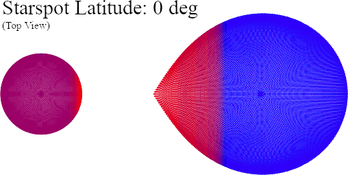
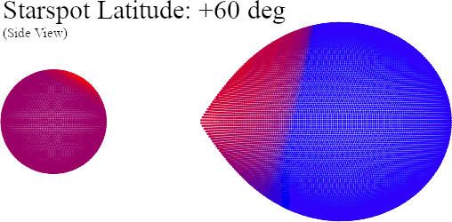
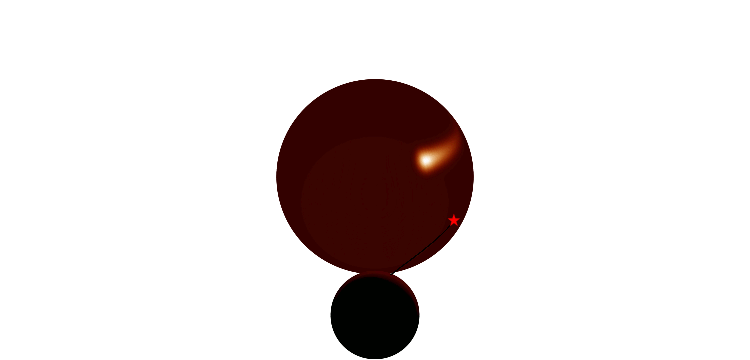

Modified copy of Tom Marsh's source code used for "lcurve". For the full set of original files, see the source repository:

    https://github.com/trmrsh

Modifications are described below.

### 1) "visualise" colors:

visualise.cc now plots colors based on surface element temperature, normalized by the [min_temperature, max_temperature] of all of the surface elements across star1 and star2 together.

Running "visualise" includes prompts to define the colormap used for the plot. The following colormaps are available:
<ul>
<li>viridis (sequential)</li>
<li>inferno (sequential)</li>
<li>magma (sequential)</li>
<li>plasma (sequential)</li>
<li>cividis (sequential)</li>
<li>seismic (diverging red-blue)</li>
<li>vanimo (diverging green-purple)</li>
<li>redblue (two-tone)</li>
<li>black (mono)</li>
</ul>

The "reverse" parameter reverses the color maps. The "colorscale" parameter allows for log10 or linear scaling. The "ncolors" parameter defines the resolution of the color grid (between 16-239).

### 2) Starspot irradiation:

The original code treats star1 as a point source for irradiation onto star2. This worked well, but meant ignoring contribution from star1's starspots. I've adjusted the source code to allow the user to enable an optional flag (finite_irr12) in their parameters.txt file to include contribution from all of star1's surface elements as irradiation contributors towards star2.

This was done via a nested loop, so the runtime increases significantly when enabled (I observed a runtime increase from roughly 0.5s to 1.5s per calculation). Try to keep the stellar grid resolution parameters (nlat1c, nlat2c, nlat1f, nlat2f) low since set_star_continuum() runtime grows as $\mathcal{O}(N^2)$ with this flag enabled.

### 3) Direct-impact starspot with advection (new parameters: stsp1i\_):

I've replaced the "uniform equatorial starspot" on star1 with a starspot that includes FWHM decay parameters for latitude and two longitude directions separately. The positive longitude direction corresponds to "downstream" relative to the stellar spin direction and includes an exponential tail to the flux decay to simulate advection in direct-impact accretion binaries. This new spot can be placed at any latitude to account for polar-like accretion onto magnetic poles.

Longitudes are considered "upstream" only within -5\*stsp1i_fwhm_long1 of the impact spot center. All other longitudes are considered "downstream" and use stsp1i_fwhm_long2 to simulate Gaussian decay with an exponential tail, allowing the smeared spot to smoothly extend nearly the full 360 degrees around the stellar surface. The animation below shows an exaggerated effect for demonstration.

### 4) Filter curve integration

I've added a new optional parameter to the parameters.txt file named "filter", which allows the software to calculate flux values by integrating across a given preset filter profile. The original lcurve behavior is to return the single-wavelength flux. Setting filter=none will revert to this behavior. Setting filter={filename} will use the filter curve provided in the file found at "/filter_curves/filename". The name is case-sensitive and must match the filename exactly, or it will throw an error.
