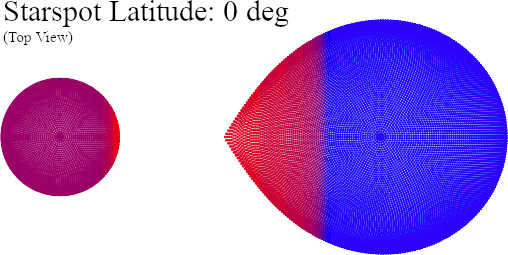
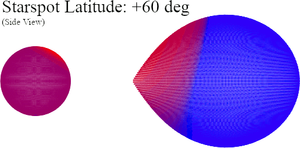
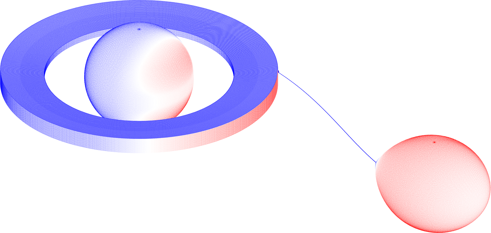
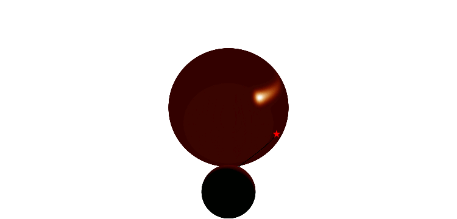

Modified copy of Tom Marsh's source code used for "lcurve". For the full set of original files, see the source repository:

    https://github.com/trmrsh

Modifications are described below.

An lcurve workflow tutorial is provided in a Jupyter notebook within the tutorial directory (see <a href=https://github.com/AlekzanderKosakowski/lcurve/blob/main/tutorial/tutorial_wrapper.ipynb>tutorial_wrapper.ipynb</a>)

### 1) "visualise" colors:

visualise.cc now plots colors based on surface element temperature, normalized by the [min_temperature, max_temperature] of all of the surface elements across star1 and star2 together.

Running "visualise" includes prompts to define the colormap used for the plot. The following colormaps are available:

<ul>
<li>viridis (sequential)</li>
<li>inferno (sequential)</li>
<li>magma (sequential)</li>
<li>plasma (sequential)</li>
<li>cividis (sequential)</li>
<li>seismic (diverging red-blue)</li>
<li>vanimo (diverging green-purple)</li>
<li>redblue (two-tone)</li>
<li>black (mono)</li>
</ul>

The "reverse" parameter reverses the color maps. The "colorscale" parameter allows for log10 or linear scaling. The "ncolors" parameter defines the resolution of the color grid (between 16-239).

### 2) Finite-radius irradiation:

The original code treats star1 as a point source for irradiation onto star2. This worked well, but meant ignoring contribution from star1's starspots. I've adjusted the source code to allow the user to enable an optional flag (finite_irr12) in their parameters.txt file to include contribution from all of star1's surface elements as irradiation contributors towards star2.

This was done via a nested loop, so the runtime increases significantly when enabled (I observed a runtime increase from roughly 0.5s to 1.5s per calculation). Try to keep the stellar grid resolution parameters (nlat1c, nlat2c, nlat1f, nlat2f) low since set_star_continuum() runtime grows as $\mathcal{O}(N^2)$ with this flag enabled.

When an opaque accretion disc is enabled, the finite-radius irradiation between stars will be blocked by the disc geometry, creating a band of lower surface temperature within the shadow of the disc on the irradiated star. The image below shows an exaggerated system with this effect enabled. When finite_irr is disabled, the original point-source irradiation behavior is applied between the stars and the disc does not block the irradiation. Irradiation onto the accretion disc from the donor star is still treated with a point-source approximation.

### 3) Direct-impact starspot with advection (new parameters: stsp1i\_):

I've replaced the "uniform equatorial starspot" on star1 with a starspot that includes decay parameters for a Gaussian core and exponential tail in the direction of stellar rotation. The positive longitude direction corresponds to "downstream" relative to the stellar spin direction and includes an exponential tail to the flux decay to approximate advection in direct-impact accretion binaries. This new spot can be placed at any latitude to account for polar-like accretion onto magnetic poles.

Longitudes are considered upstream only within -5\*stsp1i_fwhm_long of the impact spot center. All other longitudes are considered downstream. The core FWHM is defined by the stsp1i_fwhm_long and stsp1i_fwhm_lat parameters. The exponential tail is defined by the scale length parameter stsp1i_escale_len. The animation below demonstrates this feature in an exaggerated system.

### 4) Filter curve integration

I've added a new optional parameter to the parameters.txt file named "filter", which returns a weighted mean blackbody intensity for a given filter profile and temperature.

$$
\frac{
\sum\limits_{i=1}^{N}
B_{\lambda}(\lambda_i,T)\ \cdot R(\lambda_i)\ \cdot \lambda \cdot \Delta\lambda
}{
\sum\limits_{i=1}^{N}
R(\lambda_i)\ \cdot \lambda \cdot \Delta\lambda
}
$$

Setting filter={filename} will use the filter curve provided in the file found at "/filter_curves/filename". The name is case-sensitive and must match the filename exactly, otherwise it will throw an error.

The original lcurve behavior is to return the monochromatic flux (at a single wavelength) from the blackbody curve at the given temperature. Setting filter=none will revert to this behavior.

### 5) Updated Subs::planck.cc to use the $B_\lambda$ Planck function and its logarithmic derivative to allow for proper filter integration:

$$\frac{2hc}{\lambda^3}\left(\exp{\left(\frac{hc}{\lambda KT}\right)}-1\right)^{-1}\longrightarrow\frac{2hc^2}{\lambda^5}\left(\exp{\left(\frac{hc}{\lambda kT}\right)}-1\right)^{-1}$$

Previously, the Planck function used $B_\nu$, which would not integrate over wavelength properly when determining filter-averaged intensities.

### 6) Updated how Third Light is handled:

The original code treats third light as a hard-coded single-value "flux" added directly to the total system "flux". While this was a fitted parameter, it meant using different values for each filter. I've updated the code to treat third light as a third stellar blackbody with temperature (parameter t3) and scaled radius (parameter r3) at the same distance as the inner binary being modeled. The original $\texttt{third}$ parameter has been replaced with a boolean flag (1/0) to enable/disable this extra component.

This third body is treated as a point source and its flux is added to the total system flux based on its radius and temperature parameters: $F_3 = \pi R_3^2 B_\lambda(\lambda,T_3) \cdot LDC3$

Additional parameters for limb darkening have been included for this third component: (ldc3_1, ldc3_2, ldc3_3, ldc3_4) and limb3. These have the same representation as limb darkening parameters used for star1 and star2, but are applied using the disc-averaged equations for the Claret 4-parameter and Polynomial limb darkening equations.
